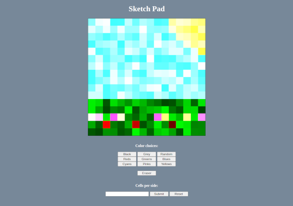

# odin-etch-a-sketch

By the end of this project, I will be able to:
- create a grid with javascript of any input size
- implement a hover affect that gives each grid cell a random background color

## Screenshot

